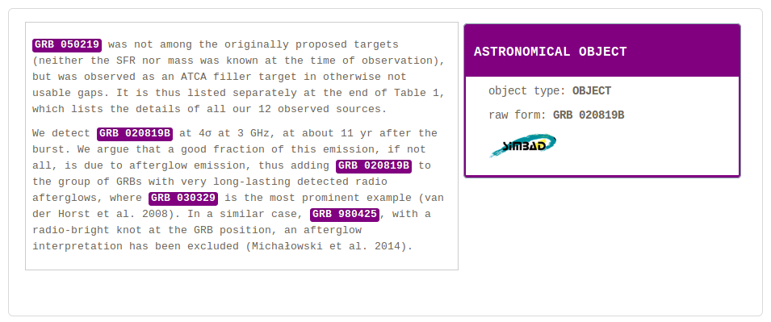

# grobid-astro

[](http://www.apache.org/licenses/LICENSE-2.0.html)

The goals of this GROBID module are: 

1. to recognize in textual documents and PDF any mentions of astronomical objects,  

2. to disambiguate the mention with respect to the astronomical knowledge base SIMBAD. 

As the other GROBID models, the module relies only on machine learning and uses linear CRF. 

* Example: Astronomical object recognition in a text segment with link to Simbad entry


## Install, build, run

Building grobid-astro and JDK 1.8 (gradle wrapper is shipped with the code).  

First install the latest development version of GROBID as explained by the [documentation](http://grobid.readthedocs.org).

Copy the module astro as sibling sub-project to grobid-core, grobid-trainer, etc.:
> cp -r grobid-astro grobid/

> cd grobid-astro/

Copy the existing trained model in the standard `grobid-home` path, type the command under `grobid/grobid-atro` path:

> ./gradlew copyModels 

Try compiling everything with:

> ./gradlew clean build

Run some test: 
> cd PATH-TO-GROBID/grobid/grobid-astro

> ./gradlew test

**The models have to be trained before running the tests!** - See bellow for training an astro model. 

## Start the service

> ./gradlew appRun

Demo/console web app is then accessible at ```http://localhost:8080```. Remember to close it by pressing a button and not via ctrl+c or the java process won't be killed. 

Using ```curl``` POST/GET requests:


```
curl -X POST -d "text=Look at GRB 020819, on the right." localhost:8080/service/processAstroText
```

```
curl -GET --data-urlencode "text=Look at Andromeda below the North Star." localhost:8080/service/processAstroText
```

## Training and evaluation

### Training only

For training the astro model with all the available training data:

```
> cd PATH-TO-GROBID/grobid/grobid-astro

> ./gradlew train_astro
```

The training data must be under ```grobid-astro/resources/dataset/astro/corpus```

### Evaluating only

For evaluating under the labeled data under ```grobid-astro/resources/dataset/astro/evaluation```, use the command:

```
>  ./gradlew eval_astro
```

### Training and evaluating with automatic corpus split

The following commands will split automatically and randomly the available annotated data (under ```resources/dataset/astro/corpus/```) into a training set and an evaluation set, train a model based on the first set and launch an evaluation based on the second set. 

```
>  ./gradlew eval_astro_split
```

In this mode, by default, 80% of the available data is used for training and the remaining for evaluation. This ratio can be changed by editing the corresponding exec profile in the pom.xml file. 

## Training data
 
... 

## Generation of training data

For generating training data in TEI, based on the current model, from a list of text or PDF files in a input repository, use the following command: 

```
> java -Xmx4G -jar build/libs/grobid-astro-0.5.1-SNAPSHOT-onejar.jar -gH ../grobid-home -dIn ~/test_astro/ -dOut ~/test_astro/out/ -exe createTraining
```


## License

GROBID is distributed under [Apache 2.0 license](http://www.apache.org/licenses/LICENSE-2.0). 